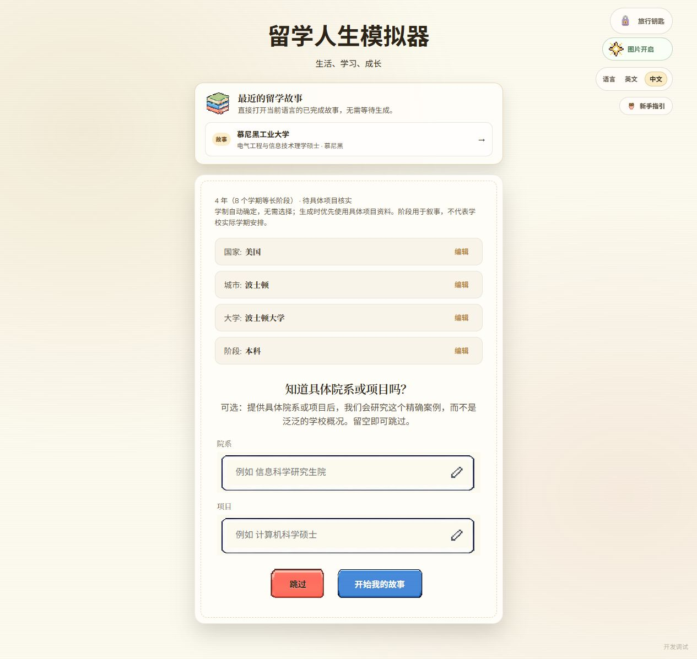

# 面向中国与斯里兰卡女性的支持型留学探索

更新日期：2026-10-01。落实本轮三个决定：自动学制、固定实验角色与语言、以信息学习和支持性经历为主。

## 1. 自动决定时长

已删除学期滑块及自定义学位入口，保留本科与授课型硕士。选择学位后直接进入可选的院系／项目细化，显示自动推断的时长。服务端也重新计算，旧客户端提交的任意学期数不会改变新故事时长。

| 目的地与学位 | 项目资料取得前的叙事估计 |
| --- | --- |
| 美国本科 | 4 年，8 个半学年阶段 |
| 美国硕士 | 暂按 2 年，4 个阶段 |
| 英国本科 | 3 年，6 个阶段；识别到苏格兰地区时按 4 年、8 个阶段 |
| 英国授课型硕士 | 暂按 1 年，2 个阶段 |
| 德国本科 | 暂按 3 年，6 个阶段 |
| 德国硕士 | 暂按 2 年，4 个阶段 |
| 其他国家 | 本科暂按 4 年、硕士暂按 2 年，明确标记待核实 |

这些是初始叙事估计，不是所有院校统一学制。研究阶段若取得具体全日制项目的明确月份及对应官方项目资料，便覆盖初始值，例如 18 个月变成 3 个阶段。模糊范围、非全日制信息、缺少引用或第三方资料不能直接覆盖。合并研究批次时通过原始 URL 重新映射学制引用，避免不同批次都使用 S01 而串错证据。

学期长度用于故事安排，并不宣称学校使用两学期校历。生成器会安排第一阶段的入学适应，以及后续每个阶段的学习里程碑，覆盖专业项目、反馈、同伴合作、导师支持和完成学位；主要支持路线必须经过所有阶段，再进入毕业与未来选择。

依据：英国本科通常三年、苏格兰通常四年，研究生课程不少为一年，见 [British Council](https://study-uk.britishcouncil.org/plan-studies/choosing-course/modules-courses)。美国本科四年及学期／季度学分差异见 [EducationUSA Belgium](https://www.educationusa.be/undergraduate-studies/)；美国硕士一般可为一至三年，不能把两年当统一事实，见 [EducationUSA](https://educationusa.state.gov/your-5-steps-us-study/research-your-options/graduate/what-graduate-student)。德国本科可为六至八学期、硕士二至四学期，见 [德国联邦就业局](https://web.arbeitsagentur.de/berufenet/bba/studium/studiendauerundaufbau/regelstudienzeit)。

## 2. 固定实验群体，增强角色的具体感

- 中国入口：中文、中国女性主角、人民币参考换算。
- 斯里兰卡入口：英文、斯里兰卡女性主角、斯里兰卡卢比参考换算。
- 国籍与留学目的地分开记录。研究提示加入对应国籍的签证／材料适用对象，回国结局也保持一致。
- 规划、正文、变体和插图共用角色规则。插图优先读取故事已保存的角色语言，避免补图时因运行配置缺失而换人。
- 不再统一指定 24 岁。人物阶段符合本科／硕士背景；外貌是一位虚构人物的连续设定，不代表该国女性的统一外貌。
- 开篇建立具体的 STEM 兴趣、已有能力、个人目标和可信任的人际关系，后续呼应。加入完成任务、获得反馈、建立归属感、主动求助等可实现的正向体验。
- 不因国籍／性别自动假设贫困、宗教、家庭反对或能力不足；结构性障碍不归咎于个人。具体资助、服务、政策仍要求证据。

语言检查继续覆盖正文、选项、注释、变体和资料卡。中文首页的英文手写背景已替换为无文字纸张效果。院校官方专名和必要缩写仍可保留。

上述内容是已实现的提示规则、元数据约束和语言校验，不等于已经证明人物有共情效果。共情程度应通过两地参与者对角色可信度、代入感和行动自主性的反馈判断。

## 3. 学习型玩法已经生效

播放器默认使用支持型探索。资源数值只提示需要关注的方面；低至零也不会自动造成拒签、退学或旅程终止，也不会虚构一笔补助或自动恢复资源。低数值会打开一次支持提示，然后回到原先选择的结果。

有明确剧情依据的严重后果保留，点击前会标明这是一条严重后果路线。到达后可以直接回看决定、重试，不必先观看原有的喜剧回卷。现实中的政策后果不被描述为可以自动撤销。

新生成选项以三种可信路径构成：务实规划、主动求助／探索、存在不确定性的合理替代方案。原有内部选项类型仅为兼容数据格式保留，不能再据此生成鲁莽行为作为固定“错误答案”。

新增生成校验标准：

1. 每个决定至少有两条不直接进入严重后果的路线。
2. 直接进入严重后果的选项不超过所有决策选项的 10%，且带有证据引用。
3. 全旅程按每次等概率随机选项计算，遇到严重后果的概率不超过 20%。这是可调整的初始内容标准，不是对真人成功率的承诺。
4. 主要支持路线必须完成全部学习阶段并抵达非失败结局。
5. 新故事必须具有一致的实验角色、输出语言和时长信息；不符合标准的故事不能发布。

在生成正文和图片前，路线规划阶段已经检查随机路线风险与断路／循环，并尝试修复；最终发布前再次检查。学习模式的数值不会改变路线终点，因此对相同后续路径复用计算结果，避免逐条展开本科学制下指数增长的路线。测试覆盖 20 个连续三选一节点，共 3²⁰ 条路径的精确计数。

## 4. 验证结果及旧故事的边界

- 29 项自动化测试通过；前后端 TypeScript 检查与前端生产构建通过。
- 对 37 份历史故事，每份分别运行 250 次旧规则及 250 次学习规则，总计 18,500 次；没有发现断路或循环导致的步数超限。
- 浏览器实测：首屏两个实验入口；中文英国硕士自动显示一年／两个阶段；英文美国本科自动显示四年／八个阶段；切换中文后实体名、说明与背景同步更新；正式故事页显示学习模式。
- 没有调用收费生成模型，没有重新生成研究资料、故事正文或插图。因此本次不能报告新生成故事的真实内容质量或参与者的共情效果。

对照模拟在首次进入严重后果页面时停止，不使用重试。这比此前只统计终点的检查更严格；“非失败结局”也包含重新规划或回国等结局，不等于成功毕业。

| 旧完整故事 | 旧规则抵达非失败结局 | 仅启用学习规则后 |
| --- | ---: | ---: |
| 苏黎世联邦理工 | 22 / 250 | 143 / 250 |
| 新加坡国立大学 | 16 / 250 | 91 / 250 |
| 慕尼黑工业大学 | 24 / 250 | 86 / 250 |
| 东京大学 | 47 / 250 | 222 / 250 |

旧故事本身仍含较多严重后果分支，部分还存在旧角色、时长或语言问题。它们保留作为历史样例；本轮没有为降低失败率而篡改其情境事实。新生成缓存已升级版本，自动时长、角色和内容规则须通过新生成体现。**正式实验应使用按新规则生成并经过人工内容审核的故事，不应直接把这些历史缓存当作实验材料。**

数据见 [learning-audit-data.json](learning-audit-data.json)。复查命令：

```powershell
node backend/node_modules/tsx/dist/cli.mjs --test tests/runtime.test.ts
node backend/node_modules/typescript/bin/tsc -p backend/tsconfig.audit.json
node frontend/node_modules/typescript/bin/tsc --noEmit -p frontend
node backend/node_modules/tsx/dist/cli.mjs scripts/audit-learning.ts
npm.cmd --prefix frontend run build
```

## 后续需要研究决策的部分

这次没有新增参与者数据采集。建议后续决定是否记录信息理解、支持渠道记忆、继续探索意愿与角色代入感，而不仅是是否到达结局。还需决定本科与硕士不同故事长度如何控制实验暴露时长，以及 20% 的内容标准是否需在小规模试玩后进一步降低。

新规则也会增加本科故事的内容量和生成时间；图片总预算、生成进度及断点恢复仍是独立待选优化。


